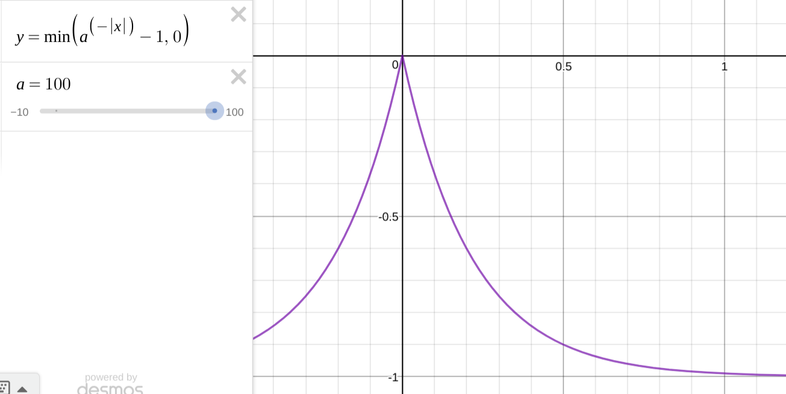

### Dependencies
1. pyquaternion:  
http://kieranwynn.github.io/pyquaternion/

2. rl:  
https://github.com/ikostrikov/pytorch-ddpg-naf  
keep the repo in the directory "vca/graph_learning/src/" and change name as "rl". Also, add \__init__.py in the repo to make it a library.

### Random Walk
The leader randomly walks and then the followers chase.
``` bash
roscore
rosrun stage_ros stageros $(rospack find robots)/world/stage_sim/simple_world.world  
python env.py -r
```

### Reinforcement Learning
1. Models  
- DDPG -- [Continuous control with deep reinforcement learning](https://arxiv.org/abs/1509.02971)  
- NAF -- [Continuous Deep Q-Learning with Model-based Acceleration](https://arxiv.org/abs/1603.00748)  

2. Reward Functions:  
(1) relation constraint in a group: 
  

(2) reward from reaching a goal.  
(3) progressive reward: this is only used to initiate weights during training. r = (dist2goal - dist2goal')/dist2goal  
(4) collision reward from any robots and walls.

### Neural Networks
1. MLPs - vca/graph_learning/src/fc.py
- fc.FC2Layers
- fc.FC2LayersShortcut  

2. ResNet - vca/graph_learning/src/resnet.py
- resnet.ResNet18
- resnet.ResNet34
- resnet.Resnet50

3. Actor-Critic - vca/graph_learning/src/rl  

4. Relation Network
